# DOCTOR WHERE

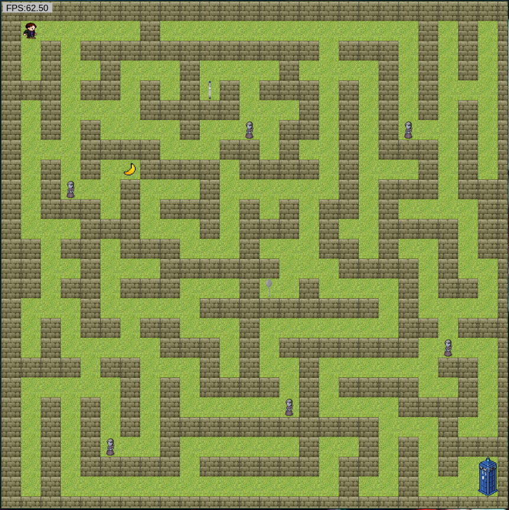

##  <a name='Tableofcontents'></a>Table of contents

<!-- vscode-markdown-toc -->
 1. [ Introduction](#Introduction)
 2. [ Installation manual fd](#Installationmanualfd)
 3. [ Context and instructions](#Contextandinstructions)
 4. [ Packages and dependencies](#Packagesanddependencies)
 5. [ Structure](#Structure)

	 5.1. [Images and videos](#Imagesandvideos)

	 5.2. [Code examples](#Codeexamples)
 6. [ Documentation](#Documentation)
 7. [ License](#License)

<!-- vscode-markdown-toc-config
	numbering=true
	autoSave=true
	/vscode-markdown-toc-config -->
<!-- /vscode-markdown-toc -->


##  1. <a name='Introduction'></a> Introduction

This is my first project for [CORE Code School](https://www.corecode.school/).

You can play it [here](https://yolmm.github.io/Doctor-where/).

##  2. <a name='Installationmanualfd'></a> Installation manual

```bash
#Clone the repository:
git clone https://yolmm.github.io/Doctor-where/

#Initiate npm:
npm init
#Or use this instead:
npm init -y

#Install dependencies:
npm install

#Execute the project:
npm run dev
```

##  3. <a name='Contextandinstructions'></a> Context and instructions

"People assume that time is a strict progression of cause to effect, but actually from a non-linear non-subjective viewpoint it's more like a big ball of wibbly wobbly timey wimey [stuff](https://youtu.be/cwdbLu_x0gY)."

Time War is finally over and The Doctor has just regenerated, so he can be a traveller once again and keep exploring time and space while battling injustice. All he has to do is going inside the TARDIS, find a companion and have fun. But where is the TARDIS? More important, where is he? And why those angel statues are so sad?

It looks like The Doctor is in the middle of a labyrinth and the TARDIS is outside of it. Help The Doctor reach the TARDIS!

- Move with keyboard arrows.
- Avoid the weeping angels; if they trap The Doctor, you will start from the beginning.
- To win, The Doctor have to arrive to the TARDIS.
- There are three objects: a sonic screwdriver, a banana and a spoon. You don't need them to win, but it could help you win easily if you pick them all.


"Don't turn your back, don't look away, and don't blink. Good luck."

##  4. <a name='Packagesanddependencies'></a> Packages and dependencies

- Node package manager: [npm](https://www.npmjs.com/)
- To run the HTML: [parcel](https://www.npmjs.com/package/parcel)
- For github pages: [rimraf](https://www.npmjs.com/package/rimraf)
- Language used: [typescript](https://www.npmjs.com/package/typescript)

##  5. <a name='Structure'></a> Structure

###  5.1. <a name='Imagesandvideos'></a>Images and videos


###  5.2. <a name='Codeexamples'></a>Code examples

The first map I created was in a sheet with pens, a pencil and a rubber:

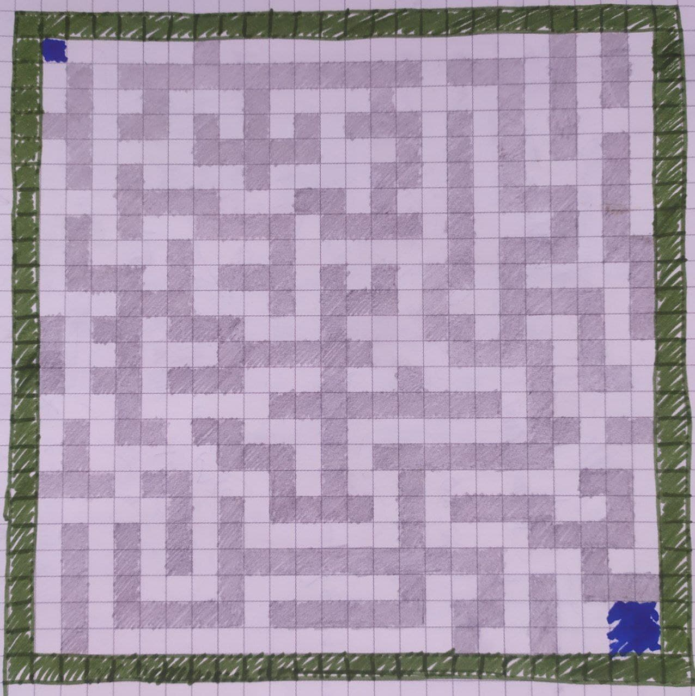
 
Once I had it, I created an string in the map file, where the 'W' is a wall and the '.' is the path:

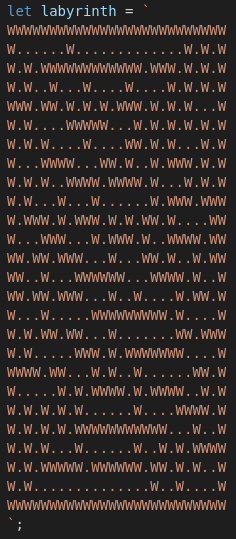

Then, I was able to operate with it, for what I used a for loop inside a for loop to create a grid that I would use later for actors' movements:

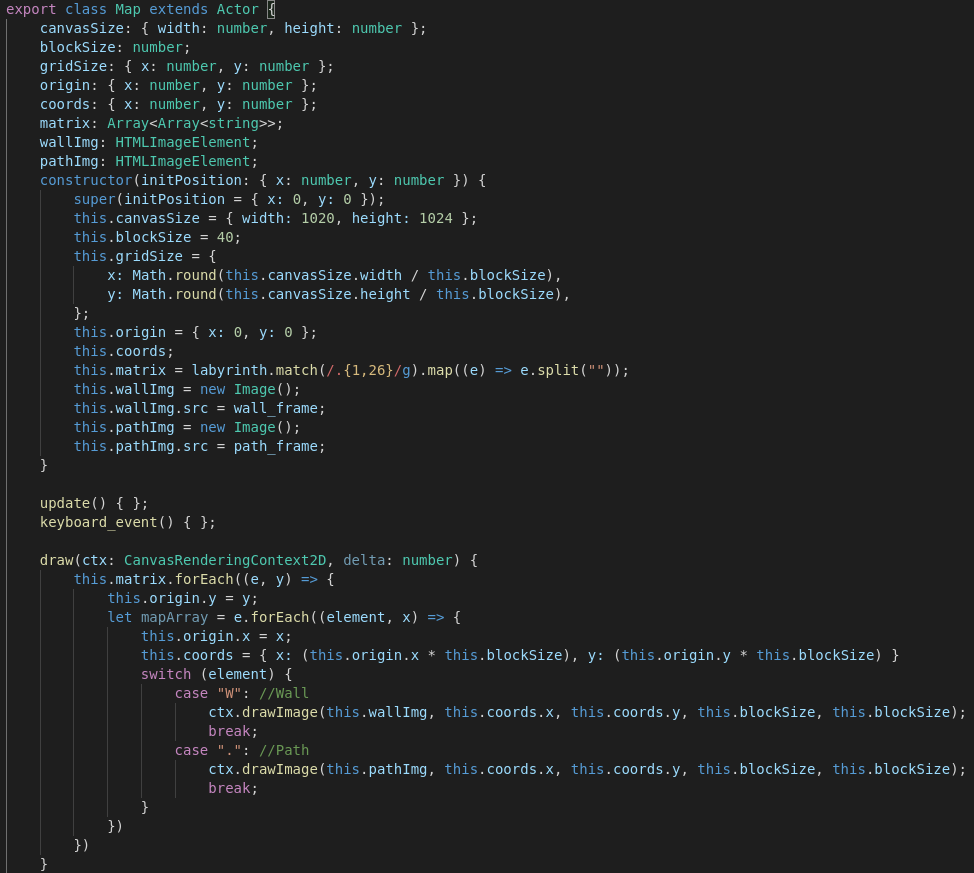

This was the first result (red for walls, green for paths, black for The Doctor and blue for the TARDIS):


For The Doctor's movement, I used a function with a switch statement, where it calls another function that check if next step is a wall or no (if it is a wall, the actor won't move). An example of movement function:

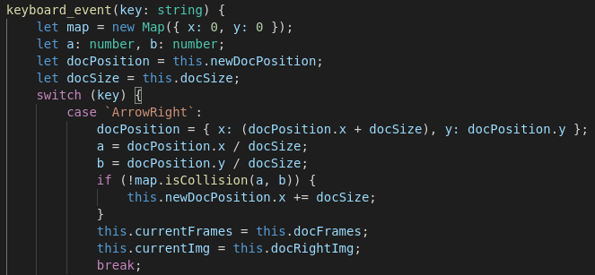

And the code of the collision function:

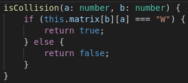

Once I have the first actor created, for the Weeping Angels, I just had to copy most part of the code. Actually, the angels' movement is the same as The Doctor's, but with exchanged movement:
- When arrow right key is pressed, The Doctor moves one position to the right and the angels move one position to the left.
- For arrow left key, The Doctor moves one position to the left while the angels move one position up.
- For arrow down key, The Doctor moves one position down and the angels move one position to the right.
- And when arrow up key is pressed, The Doctor moves one position up while the angels move one position down.

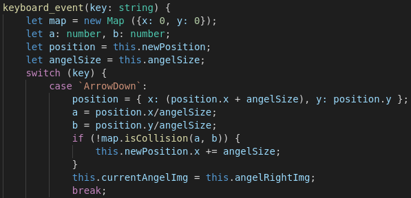

After create the Weeping Angels, I wanted them to interact with The Doctor. in order to get that, I used a function that checks The Doctor's position and the angels' position. If their position is the same, this function create a new Doctor with the initial position and replace The Doctor in the actors' array:

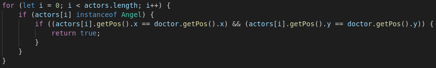

When all the basic functionallity was ready, I started with characters' images. It was easy for the angels, as they are statues, so it was changing one single image for another. However, for The Doctor, I had to create an array to get the frames and use the draw function to iterate that array using the frames per seconds of the game.

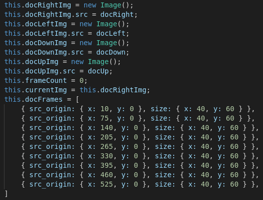
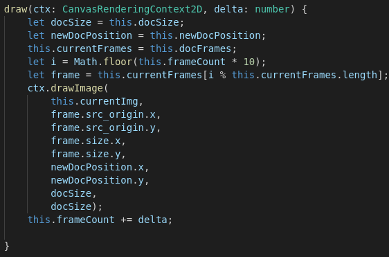


Then, I created a new actor as the TARDIS and a new function to win; when The Doctor arrive to the TARDIS position, the actor that represent The Doctor is remove from actors' array and the TARDIS image change to another with 10% more of transparency. The last image is transparent, so it looks like the TARDIS has vanish with The Doctor inside it.

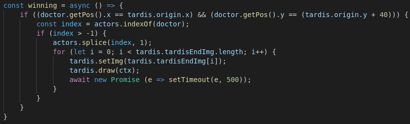
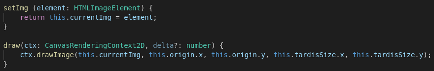
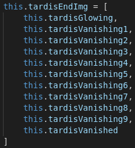

Finally, I added three objects 

##  6. <a name='Documentation'></a> Documentation

Doctor Who [info](https://en.wikipedia.org/wiki/Doctor_Who)

To create the main characters: [sprite sheet generator](https://sanderfrenken.github.io/Universal-LPC-Spritesheet-Character-Generator/#?body=Humanlike_white)

[Canvas docs](https://developer.mozilla.org/es/docs/Web/API/CanvasRenderingContext2D)

Background [music](https://www.youtube.com/watch?v=K7VmOZ4Ppj8)

Background [image](https://asset-manager.bbcchannels.com/workspace/uploads/brandedangel-alicexzhang-1920x1080-56d470f1.png)

##  7. <a name='License'></a> License